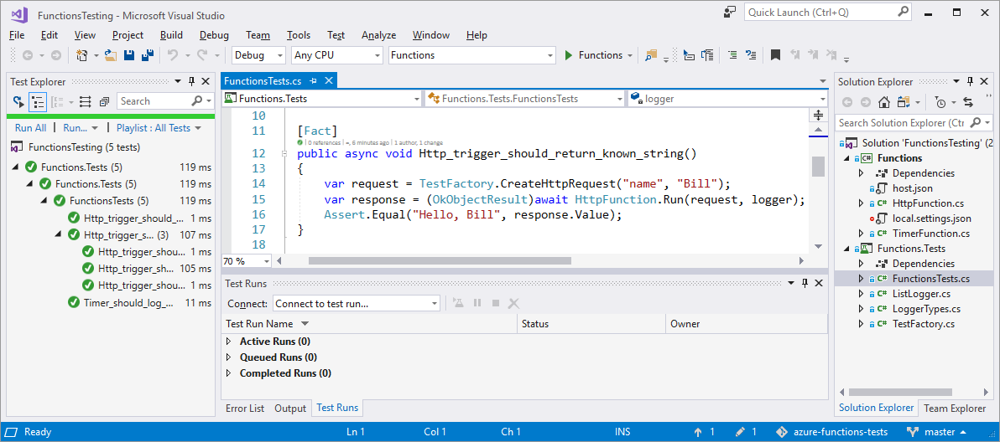
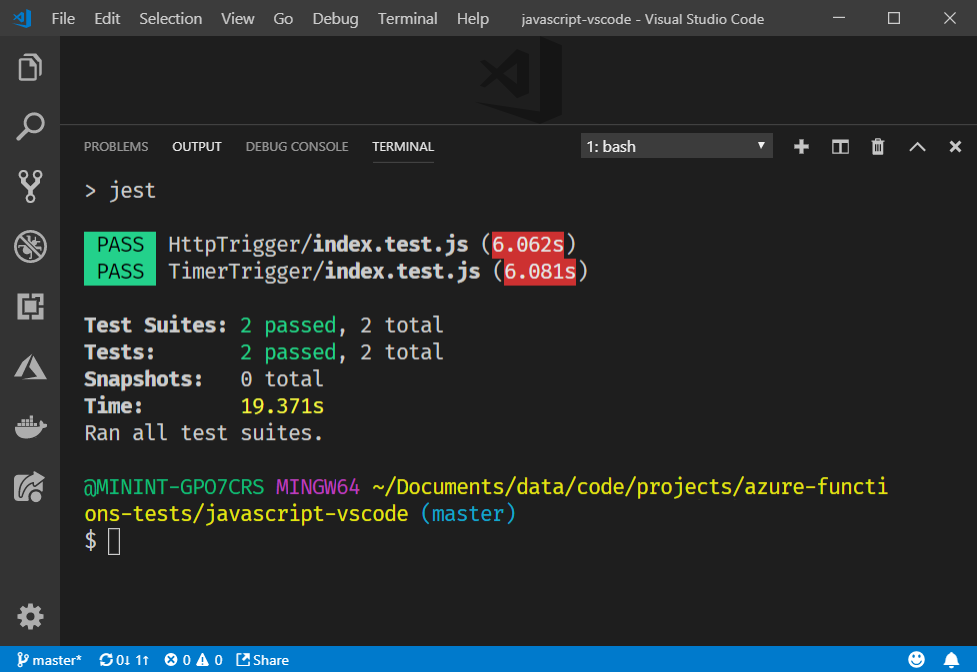

# Testing Azure Functions
This repository includes examples demonstrating how to run tests against a HTTP triggered and timer triggered function in both C# and JavaScript. The C# implementation uses [xUnit](https://xunit.github.io/) in [Visual Studio](https://visualstudio.microsoft.com/) and the JavaScript examples use [Jest](https://jestjs.io/) for automated tests and work best with [Visual Studio Code](https://code.visualstudio.com/).

## C# in Visual Studio

To run the C# tests open the file *csharp-visualstudio\FunctionsTesting.sln* in Visual Studio. After you have restored all the dependencies, build and run all tests. The output from the tests should look something like the following:



To debug your tests, set a breakpoint in your code navigate to the Test Explorer. Then click Run... > Debug Last Run.

## JavaScript in VS Code

Open the folder *javascript-vscode* in VS Code. Run `npm install` to restore all dependencies and then run `npm test` to run the tests. The output from the tests should look something like the following:



To debug you tests, set a break point in your code and add the follow configuration to *launch.json* before starting a debug session.

```json
{
  "configurations": [
    {
      "type": "node",
      "request": "launch",
      "name": "Debug Tests",
      "program": "${workspaceRoot}\\node_modules\\jest\\bin\\jest.js",
      "args": [
          "-i"
      ],
      "internalConsoleOptions": "openOnSessionStart"
    }
  ]
}
```